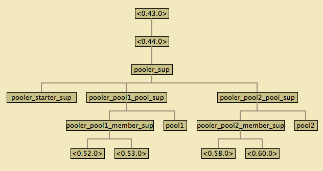

* pooler - An OTP Process Pool Application

The pooler application allows you to manage pools of OTP behaviors
such as gen_servers, gen_fsms, or supervisors, and provide consumers
with exclusive access to pool members using =pooler:take_member=.

#+ATTR_HTML: alt="Build status images" title="Build status on GitHub-CI"
[[https://github.com/epgsql/pooler/actions][https://github.com/epgsql/pooler/actions/workflows/ci.yml/badge.svg]]

** What pooler does

- *Exclusive member access* — each consumer gets sole ownership of a member for the duration of its work; pooler monitors consumers and reclaims members automatically on exit
- *Fixed and dynamic sizing* — pools grow on demand up to =max_count= and cull idle members back to =init_count= on a configurable schedule
- *Blocked-caller queuing* — =take_member/2= queues callers with a timeout instead of immediately returning =error_no_members= when the pool is busy
- *Responsive under slow workers* — member starts and stops run in supervised helper processes, never blocking the pool gen-server
- *Survives service outages* — returns =error_no_members= during outages without risking a supervisor restart cascade
- *Connection lifetime recycling* — =max_lifetime= proactively replaces members before external termination (firewalls, DB backends with hard connection limits); =max_lifetime_jitter= spreads expiry times to avoid thundering-herd evictions
- *Group pools and load balancing* — pools can be grouped for random-selection load balancing across backends
- *Fully supervised* — every process (members, starters, stoppers) lives under a supervision tree; shutting down a pool cleanly terminates all associated processes with no orphans
- *Observability* — utilization stats, pool metrics, and structured logging

*** Exclusive member access

Pooler monitors the *calling process* of =take_member= and uses that as the consumer identity, so =return_member= is optional for short-lived processes — pooler reclaims the member when the consumer exits.  This means the process that calls =take_member= must be the actual consumer; handing the member pid to a different process defeats the tracking mechanism.

*** Pool sizing and member lifecycle

Replacement is automatic: both a crashing member and an abnormally exiting consumer trigger destruction of the member and an async start of a replacement.  Culling runs on a configurable timer (=cull_interval=) to remove members idle longer than =max_age=, keeping resource usage proportional to actual demand.

*** Survives service outages

When the backing service is unavailable, start attempts fail and =take_member= returns =error_no_members=, letting callers handle degradation gracefully.  The pool gen-server stays alive throughout and resumes filling the pool as soon as workers start succeeding again.  Repeated failures do not risk a supervisor restart cascade because workers use a =temporary= restart strategy.

*** Keeps the pool gen-server responsive

Member starts and stops are handled by short-lived supervised helper processes, so the pool gen-server never blocks on slow worker operations (e.g. TCP handshakes or protocol teardown).

*** Group pools and load balancing

Independent pools serve different backends within the same application.  Grouped pools sharing the same =group= tag form a cluster: =take_group_member= picks a pool at random and falls back to the remaining ones if the selected pool has no free members.  A typical use is one pool per node in a database read-replica set.

** Motivation

The need for pooler arose while writing an Erlang-based application
that uses [[https://wiki.basho.com/display/RIAK/][Riak]] for data storage.  Riak's protocol buffer client is a
=gen_server= process that initiates a connection to a Riak node.  A
pool is needed to avoid spinning up a new client for each request in
the application.  Reusing clients also has the benefit of keeping the
vector clocks smaller since each client ID corresponds to an entry in
the vector clock.

When using the Erlang protocol buffer client for Riak, one should
avoid accessing a given client concurrently.  This is because each
client is associated with a unique client ID that corresponds to an
element in an object's vector clock.  Concurrent action from the same
client ID defeats the vector clock.  For some further explanation,
see [[http://lists.basho.com/pipermail/riak-users_lists.basho.com/2010-September/001900.html][post 1]] and [[http://lists.basho.com/pipermail/riak-users_lists.basho.com/2010-September/001904.html][post 2]].  Note that concurrent access to Riak's pb client is
actual ok as long as you avoid updating the same key at the same
time.  So the pool needs to have checkout/checkin semantics that give
consumers exclusive access to a client.

On top of that, in order to evenly load a Riak cluster and be able to
continue in the face of Riak node failures, consumers should spread
their requests across clients connected to each node.  The client pool
provides an easy way to load balance.

Since writing pooler, I've seen it used to pool database connections
for PostgreSQL, MySQL, and Redis. These uses led to a redesign to
better support multiple independent pools.

** Usage and API

*** Pool Configuration via application environment

Pool configuration is specified in the pooler application's
environment.  This can be provided in a config file using =-config= or
set at startup using =application:set_env(pooler, pools, Pools)=.
Here's an example config file that creates two pools of
Riak pb clients each talking to a different node in a local cluster
and one pool talking to a Postgresql database:

#+BEGIN_SRC erlang
  % pooler.config
  % Start Erlang as: erl -config pooler
  % -*- mode: erlang -*-
  % pooler app config
  [
   {pooler, [
           {pools, [
                    #{name => rc8081,
                      group => riak,
                      max_count => 5,
                      init_count => 2,
                      start_mfa =>
                       {riakc_pb_socket, start_link, ["localhost", 8081]}},

                    #{name => rc8082,
                      group => riak,
                      max_count => 5,
                      init_count => 2,
                      start_mfa =>
                       {riakc_pb_socket, start_link, ["localhost", 8082]}},

                    #{name => pg_db1,
                      max_count => 10,
                      init_count => 2,
                      start_mfa =>
                       {epgsql, connect, [#{host => "localhost", username => "user", database => "base"}]}}
                   ]}
             %% optional: enable metrics via folsom or exometer
             %% metrics_mod => folsom_metrics,
             %% metrics_api => folsom
          ]}
  ].
#+END_SRC

Each pool has a unique name, specified as an atom, an initial and maximum number of members,
and an ={M, F, A}= describing how to start members of the pool.  When
pooler starts, it will create members in each pool according to
=init_count=. Optionally, you can indicate that a pool is part of a
group. You can use pooler to load balance across pools labeled with
the same group tag.

**** Culling stale members

The =cull_interval= and =max_age= pool configuration parameters allow
you to control how (or if) the pool should be returned to its initial
size after a traffic burst. Both parameters specify a time value which
is specified as a tuple with the intended units. The following
examples are valid:

#+BEGIN_SRC erlang
%% two minutes, your way
{2, min}
{120, sec}
{120000, ms}
120000        %% plain integer — milliseconds, consistent with Erlang timeout conventions
#+END_SRC

The =cull_interval= determines the schedule when a check will be made
for stale members. Checks are scheduled using =erlang:send_after/3=
which provides a light-weight timing mechanism. The next check is
scheduled after the prior check completes.

During a check, pool members that have not been used in more than
=max_age= minutes will be removed until the pool size reaches
=init_count=.

The default value for =cull_interval= is ={1, min}=. You can disable
culling by specifying a value os ={0, min}=. The =max_age= parameter
defaults to ={30, sec}=.

**** Connection lifetime recycling (max_lifetime)

Some network infrastructure (firewalls, load balancers) and database backends impose a hard
wall-clock limit on TCP connection lifetime.  Pooler can proactively recycle members before
they are forcibly closed by setting =max_lifetime=:

#+BEGIN_SRC erlang
#{name => pg_pool,
  init_count => 10,
  max_count => 10,
  start_mfa => {epgsql, connect, [...]},
  max_lifetime => {1, hour}}
#+END_SRC

Members that reach their lifetime limit are replaced automatically:

- *While idle* — a timer fires and the member is stopped and replaced without consumer
  involvement.
- *At take* — if a timer fires late, =take_member= detects expired members at the head of
  the free list and evicts them inline before returning a live one.
- *At return* — if a member's lifetime elapsed while it was in use, =return_member= stops
  it and starts a replacement instead of putting it back in the free list.

Members held by consumers past their TTL are never forcibly evicted — they are recycled
cleanly when returned.

To avoid a thundering-herd effect where all members expire simultaneously (likely when a
fixed-size pool is first started), use =max_lifetime_jitter= to spread expiry times across
a window:

#+BEGIN_SRC erlang
#{max_lifetime => {1, hour},
  max_lifetime_jitter => {5, min}}
#+END_SRC

With this configuration each member's expiry is offset by a random value drawn uniformly
from =[-jitter, +jitter]=.  A pool of 100 connections started together will expire spread
over a 10-minute window rather than all at once.

For pools with =init_count > 1=, setting =max_lifetime_jitter= is recommended whenever
=max_lifetime= is used.  A good starting value is =max_lifetime / init_count=, which gives
roughly one replacement per replacement-time window and keeps the pool continuously
available throughout the rotation.

The default for =max_lifetime_jitter= is ={0, sec}= (no spread).  =max_lifetime_jitter= must
be strictly less than =max_lifetime=; pool start and reconfiguration fail with
=jitter_must_be_less_than_max_lifetime= otherwise.  When =max_lifetime= is not configured,
no TTL tracking is performed and there is zero per-operation overhead.

Valid time units for =max_lifetime=, =max_lifetime_jitter=, and all other =time_spec()=
values: =hour=, =min=, =sec=, =ms=, =mu= (microseconds), or a plain non-negative integer
(milliseconds).

**** Member start timeout (member_start_timeout)

The =member_start_timeout= parameter sets how long pooler will wait for a
member to be started before giving up on it.  If a starter process takes longer
than this, the starter is killed and the partially-started member is discarded.
The value is a =time_spec()= tuple; the default is ={1, min}=.

#+BEGIN_SRC erlang
#{member_start_timeout => {30, sec}}
#+END_SRC

**** Request queue limit (queue_max)

When all pool members are in use, =take_member= calls are queued up to
=queue_max= entries (default =50=).  Callers beyond this limit receive
=error_no_members= immediately rather than waiting.  Set it to =0= to disable
queuing entirely.

#+BEGIN_SRC erlang
#{queue_max => 100}
#+END_SRC

**** Proactive growth (auto_grow_threshold)

By default, pooler only starts new members on demand — when a consumer calls
=take_member= and the pool is exhausted.  Setting =auto_grow_threshold= to a
non-negative integer causes pooler to start new members proactively after each
successful =take_member= if the remaining free count has dropped to or below the
threshold.  The new starts are capped at =max_count= total.  This can help keep
latency low by warming up spare capacity before the pool is fully exhausted.
Disabled by default (=undefined=).

This option only has an effect on dynamic-sized pools (i.e. =max_count= >
=init_count=); in a fixed-size pool there are no spare slots to grow into.

#+BEGIN_SRC erlang
#{init_count => 5,
  max_count => 20,
  auto_grow_threshold => 2}   %% start new members when free_count drops to 2
#+END_SRC

**** Custom member initialization (initialize_mfa)

The =initialize_mfa= pool configuration parameter allows you to run custom
initialization logic after a member process has been started but before it is
made available to consumers.  This is useful when the member's =start_link=
returns quickly (so the supervisor is not blocked) but some slow work — such as
a TCP handshake or a database login — still needs to happen before the member
is safe to use.

The value is an ={M, F, A}= tuple.  Before calling, pooler replaces placeholder
atoms in =A=: ='$pooler_pid'= with the pid of the newly started member, and
='$pooler_pool_name'= with the member supervisor name for the pool (same
placeholders supported by =stop_mfa=):

#+BEGIN_SRC erlang
#{name => pg_pool,
  max_count => 10,
  init_count => 2,
  start_mfa => {my_conn, start_link, []},
  initialize_mfa => {my_conn, handshake, ['$pooler_pid']}}
#+END_SRC

The callback must return =ok= on success.  If it returns ={error, Reason}=,
raises an exception, or the member process dies during initialization, the
member is terminated and never added to the pool.  Pooler will log an error but
will not retry; the pool simply starts with fewer members than =init_count=
until the next growth event.

The option is also accepted by =pooler:pool_reconfigure/2=.

**** Custom member termination (stop_mfa)

By default, pooler removes a pool member by calling
=supervisor:terminate_child/2= from a supervised helper process, so the pool
gen-server is never blocked.  However, stopping members count against
=max_count= until they actually die, so a slow =stop_mfa= reduces available
capacity during teardown.

The =stop_mfa= pool configuration parameter lets you override the default.
It follows the same ={M, F, A}= convention with the ='$pooler_pid'= placeholder:

#+BEGIN_SRC erlang
#{name => pg_pool,
  ...
  stop_mfa => {my_conn, close, ['$pooler_pid']}}
#+END_SRC

The callback is called from the helper process instead of
=supervisor:terminate_child/2=.  For maximum throughput under churn, prefer a
fast or fire-and-forget teardown so that slots are freed quickly.

**** Pools with slow-starting or slow-stopping workers

For pools whose workers take significant time to start (e.g. opening a database
or network connection), the recommended configuration pattern is:

- Use =initialize_mfa= to perform the slow part of initialization (TCP handshake,
  protocol negotiation, etc.) after =start_link= returns.  Each worker's
  =start_link= completes quickly and multiple workers initialize in parallel.
- Raise =member_start_timeout= to give workers enough time to finish.
- Set =auto_grow_threshold= so the pool begins growing toward =max_count=
  while free members still exist, giving slow workers time to initialize before
  demand peaks.
- Use =take_member/2= with a non-zero timeout so callers wait in the queue while
  workers are starting rather than immediately receiving =error_no_members=.
- Set =queue_max= to match the expected peak of concurrent callers.

For pools with workers that are slow to stop, use =stop_mfa= with a fast
asynchronous teardown so that the pool is not blocked while workers drain.

*** Pool Configuration via =pooler:new_pool=
You can create pools using =pooler:new_pool/1= when accepts a
map of pool configuration. Here's an example:
#+BEGIN_SRC erlang
PoolConfig = #{
    name => rc8081,
    group => riak,
    max_count => 5,
    init_count => 2,
    start_mfa => {riakc_pb_socket, start_link, ["localhost", 8081]}
},
pooler:new_pool(PoolConfig).
#+END_SRC
*** Dynamic pool reconfiguration
Pool configuration can be changed in runtime

#+BEGIN_SRC erlang
pooler:pool_reconfigure(rc8081, PoolConfig#{max_count => 10, init_count => 4}).
#+END_SRC

It will update the pool's state and will start/stop workers if necessary, join/leave group,
reschedule the cull timer etc.
The only parameters that can't be updated are ~name~ and ~start_mfa~.

However, updated configuration won't survive pool crash (it will be restarted with old config by
supervisor). But this should not normally happen.

*** Using pooler

Here's an example session:

#+BEGIN_SRC erlang
pooler:start().
P = pooler:take_member(mysql, 5000),
% use P
pooler:return_member(mysql, P, ok).
#+END_SRC

Once started, the main interaction you will have with pooler is
through two functions, =take_member= and =return_member/3= (or
=return_member/2=).

Call =pooler:take_member(Pool)= to obtain the pid belonging to a
member of the pool =Pool=.  When you are done with it, return it to
the pool using =pooler:return_member(Pool, Pid, ok)=.  If you
encountered an error using the member, you can pass =fail= as the
second argument.  In this case, pooler will permanently remove that
member from the pool and start a new member to replace it.  If your
process is short lived, you can omit the call to =return_member=.  In
this case, pooler will detect the normal exit of the consumer and
reclaim the member.

=pooler:take_member/2= accepts a timeout (in milliseconds or as a
=time_spec()= tuple).  When no member is immediately available, the
caller is queued and waits until either a member is returned or the
timeout expires.  Note that the timeout is /soft/: it controls how
long the caller will wait in the queue, not the overall duration of the
=gen_server:call= itself (which uses =infinity=).

For dynamic-sized pools (=max_count > init_count=) be aware that
=take_member/1= passes an implicit =0= timeout and therefore always
returns =error_no_members= immediately when no member is free — even
when the pool is actively starting new members to satisfy demand.
=take_member/2= with a non-zero timeout queues the caller and delivers
the next member that becomes available, including freshly started ones.
Which variant fits best depends on your latency requirements.

If you would like to obtain a member from a randomly selected pool in
a group, call =pooler:take_group_member(Group)=. This will return a
=Pid= which must be returned using =pooler:return_group_member/2= or
=pooler:return_group_member/3=.

*** pooler as an included application

In order for pooler to start properly, all applications required to
start a pool member must be start before pooler starts. Since pooler
does not depend on members and since OTP may parallelize application
starts for applications with no detectable dependencies, this can
cause problems. One way to work around this is to specify pooler as an
included application in your app. This means you will call pooler's
top-level supervisor in your app's top-level supervisor and can regain
control over the application start order. To do this, you would remove
pooler from the list of applications in your_app.app and add
it to the included_application key:

#+BEGIN_SRC erlang
{application, your_app,
 [
  {description, "Your App"},
  {vsn, "0.1"},
  {registered, []},
  {applications, [kernel,
                  stdlib,
                  crypto,
                  mod_xyz]},
  {included_applications, [pooler]},
  {mod, {your_app, []}}
 ]}.
#+END_SRC

Then start pooler's top-level supervisor with something like the
following in your app's top-level supervisor:

#+BEGIN_SRC erlang
PoolerSup = {pooler_sup, {pooler_sup, start_link, []},
             permanent, infinity, supervisor, [pooler_sup]},
{ok, {{one_for_one, 5, 10}, [PoolerSup]}}.
#+END_SRC

*** Metrics
You can enable metrics collection by setting =metrics_mod= and =metrics_api= in
the pool config (or the =pooler= application environment).  Metrics are
disabled by default.

=metrics_api= selects the backend API: =folsom= (default when =metrics_mod= is
set) or =exometer=.  =metrics_mod= is the module that implements the chosen API
— e.g. =folsom_metrics= for folsom, or a custom module with a compatible interface.

#+BEGIN_SRC erlang
#{name => my_pool,
  ...,
  metrics_mod => folsom_metrics,
  metrics_api => folsom}
#+END_SRC

Ensure the metrics library is in your code path and has been started before pooler.

When enabled, the following metrics will be tracked:

| Metric Label                       | Description                                                                 |
| pooler.POOL_NAME.take_rate         | meter recording rate at which take_member is called                         |
| pooler.POOL_NAME.stopping_count    | histogram tracking number of members currently being stopped asynchronously |
| pooler.error_no_members_count      | counter indicating how many times take_member has returned error_no_members |
| pooler.killed_free_count           | counter how many members have been killed when in the free state            |
| pooler.killed_in_use_count         | counter how many members have been killed when in the in_use state          |
| pooler.event                       | history various error conditions                                            |

*** Demo Quick Start

1. Clone the repo:
   #+BEGIN_EXAMPLE
   git clone https://github.com/epgsql/pooler.git
   #+END_EXAMPLE
2. Build and run tests:
   #+BEGIN_EXAMPLE
   cd pooler; make && make test
   #+END_EXAMPLE
3. Start a demo
   #+BEGIN_EXAMPLE
   make run

   Erlang R16B03 (erts-5.10.4) [source] [64-bit] [smp:8:8] [async-threads:10] [kernel-poll:false]

   Eshell V5.10.4  (abort with ^G)
   1> pooler:start().
   ok
   2> M = pooler:take_member(pool1).
   <0.44.0>
   3> pooled_gs:get_id(M).
   {"p1",#Ref<0.0.0.38>}
   4> M2 = pooler:take_member(pool1).
   <0.45.0>
   5> pooled_gs:get_id(M2).
   {"p1",#Ref<0.0.0.40>}
   6> pooler:return_member(pool1, M, ok).
   ok
   7> pooler:return_member(pool1, M2, ok).
   ok
   #+END_EXAMPLE

** Implementation Notes
*** Overview of supervision

The top-level supervisor is pooler_sup. It supervises one supervisor
for each pool configured in pooler's app config.

At startup, a pooler_NAME_pool_sup is started for each pool described in
pooler's app config with NAME matching the name attribute of the
config.

The pooler_NAME_pool_sup starts the gen_server that will register with
pooler_NAME_pool as well as a pooler_NAME_member_sup that will be used
to start and supervise the members of this pool. The
pooler_starter_sup is used to start temporary workers used for
managing async member start.

pooler_sup:                one_for_one
pooler_NAME_pool_sup:      all_for_one
pooler_NAME_member_sup:    simple_one_for_one
pooler_starter_sup:        simple_one_for_one

Groups of pools are managed using the ~pg~ (OTP-23+) or ~pg2~ (OTP below 23) application. This imposes a
requirement to set a configuration parameter on the kernel application
in an OTP release. Like this in sys.config:
#+begin_src erlang
% OTP_RELEASE >= 23
{kernel, [{start_pg, true}]}
% OTP_RELEASE < 23
{kernel, [{start_pg2, true}]}
#+end_src

** Contribute

All contributions are welcome!

Pooler uses ~rebar3 fmt~ code formatter. Please make sure to apply ~make format~ before committing any code.

In ~pooler~ we are trying to maintain high test coverage. Run ~make test~ to ensure code coverage does not
fall below a threshold (it is automatically validated).

Pooler is quite critical to performance regressions. We do not run benchmarks in CI, so, to make sure your
change does not make pooler slower, please run the benchmarks before and after your changes and make
sure there are no major regressions on the most recent OTP release. The workflow is:

#+begin_src bash
$ git checkout master
$ rebar3 bench --save-baseline master  # run benchmarks, save results to `master` file
$ git checkout -b <my feature branch>

# <do your code changes>

$ rebar3 bench --baseline master  # run benchmarks on updated code, compare results with `master` results
$ git commit ... && git push ...
#+end_src

Please attach the output of ~rebar3 bench --baseline master~ after your changes to the PR description
in order to prove that there were no performance regressions. Please attach the OTP version you run the
benchmarks on.

*** New release

Our goal is to allow the hot code upgrade of ~pooler~, so it is shipped with ~.appup~ file and hot upgrade
procedure is tested in CI.

To cut a new release, do the following steps:

1. In ~src/pooler.app.src~: update the ~vsn~
2. In ~src/pooler.appup.src~: replace the contents with upgrade instructions for a new release
3. In ~test/relx-base.config~: update the ~pooler~'s app version to a previous release (or leave it without version)
4. In ~test/relx-current.config~: update the ~pooler~'s app version to a new one
5. In ~.github/workflows/hot_upgrade.yml~: update ~from_version~ to a previous release, maybe bump OTP version as well
6. Push, wait for the green build, tag

** License
Pooler is licensed under the Apache License Version 2.0.  See the
[[file:LICENSE][LICENSE]] file for details.

#+OPTIONS: ^:{}
